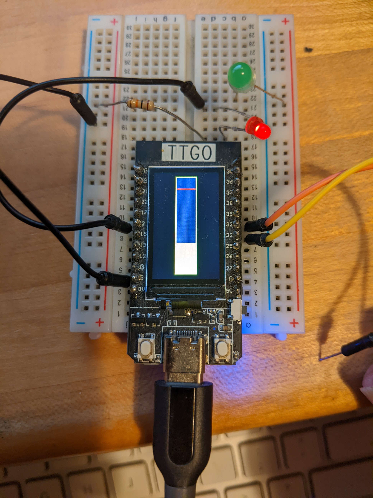
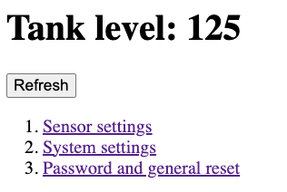
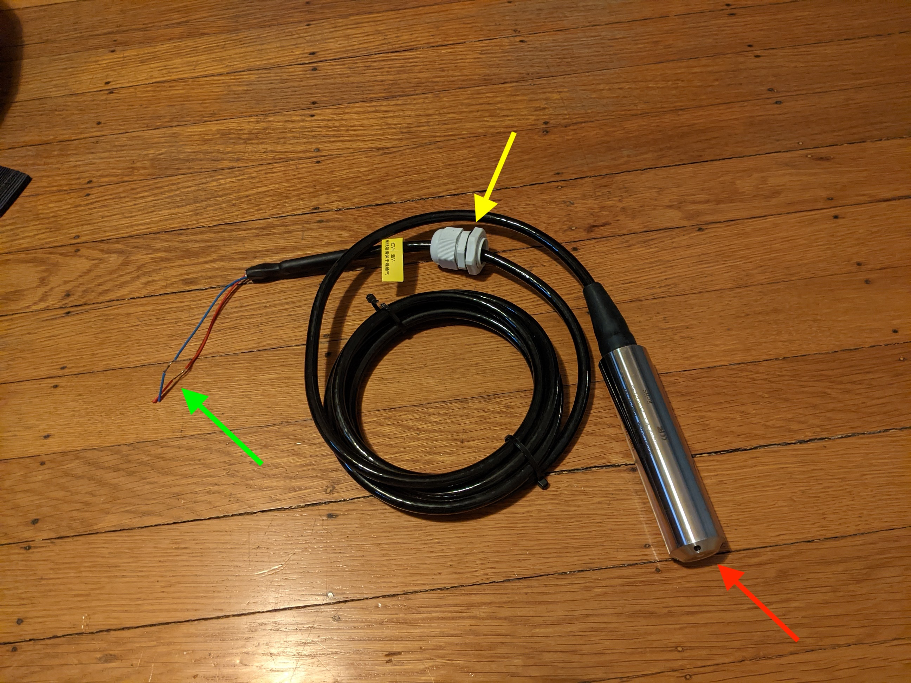

# TankSensor
ESP32=based sensor for tanks using 4-20mA sensor, and providing web access and graphics for readings

---
cmd-K V : show markdown preview

[This is a link](www.google.com)

This is an image


quotes:
> "Four score and seven..."
> *Lincoln*

Lists: start line with dashes (or stars)
- One
- Two
        * two point 5
- Three

Numeric list: (note that my numbers don't matter!)/Users/jfh/Desktop/TankSensorProject/TankSensor/TODO.txt

1. item
        1. indented item
        1. indented two
1. item
code snippets: start with triple-backtick and then proglanguage name: C, cpp, python, ...
```cpp
public main(String s)
```
Skipping the laguage name gives raw text

Separators: use "---" with a blank line before

---
# Overview
This project describes a system for measuring the fluid levels in a tank using a **4-20mA pressure sensor**, and communicating that level to a human. Other kinds of sensors could work as well, but they'd require some modifications to the code.

Here's an example of what the display would show for a tank that's about 1/3 full, and whose critical fullness is indicated with a red line at about the 90% mark. 


Here's a web view of the data produced by this project:


(This is for a different tank, whose measurements range from 0 to 200 millimeters, so it's slightly more than 50% full). As you can see, the web view lets you also easily adjust various settings for the project.

## What's physically involved
The project involves a *sensor* and a *display unit* consisting of a TTGO ESP-with-TFT-display and two tiny power supplies, one providing 24V for the sensor, the other providing about 3V for the TTGO board. In my own implementation, each of these is powered from a 12V source, but there are other alternatives. The whole project uses no more than 1/10 Amp at 12V. 

I'll refer to the sensing device as a "20mA sensor" for brevity. It looks like this:
 
and similar devices are [available from Amazon](https://www.amazon.com/dp/B07PXFPPMM/) and far cheaper from AliExpress. The red arrow points to the sensor head which needs to go at the bottom of the tank. The green arrow shows the two wires that connect to the sensor. The yellow arrow shows a "bulkhead gland" (purchased separately) that is screwed through a hole in the top of the tank, allowing the sensor cable to pass from the inside to the outside while not allowing liquid to pass. 

When you apply 24V to one of this sensor's wires (in our case, the red wire is marked "+"), and 0V to the other (in our case, the blue wire), the sensor allows some current to flow: 4mA if the sensor is at the bottom of its range, 20mA if it's at the top (or higher) limit of its range. 

```
           Current-> 
+24V ------------------->SENSOR->.
 				 |
 				 |
0V <-----------------------------.
```
We will place a resistor in the circuit (we'll use 150 ohms in this example) like this
```
           Current-> 
+24V ------------------->SENSOR->.
 				 |
 				 |
0V <------[150 Ohm]--------------.
```
If 20mA flows through 150 Ohms, then by Ohm's Law ($E = IR$), we have that the voltage difference between the two ends of the resistor will be 
150 Ohms * (20/1000) A = 3000/1000 V =  3V. That's something we can measure with a voltmeter, for instance, and it's also just below the threshold for the ADC pin on the ESP32, which can handle voltages up to 3.3V.  

Side note: the power dissipated by the resistor is $I^2 R = (.02)^2 * 150 = .06 W$, i.e., much less than a tenth of a Watt, so a 1/8 watt resistor will suffice in this circuit. 

The sensor I'm using is a 2-meter depth sensor: when the water level is the same as the level of the sensor tip (usually the bottom of the tank), the current will be 4mA; when the water depth is 2 meters, it'll be 20mA. Of course, if my tank is only 0.8m, I'll never get to a reading of 20mA; the largest I'll ever see is $(0.8m)/2m * 20 mA = 8mA$. That'll give me a voltage difference of $8mA * 150 Ohm = 1.2V$. So I'll need to make the software handle the fact that readings between 0.6V and 1.2V correspond to water depths in my tank between 0 (empty) and 0.8m (full). 

The first step is to get this voltage reading into the ESP32 processor. Fortunately, the ESP32 has an analog-to-digital converter (ADC). (It actually has two, but one of them is used by the WiFi software, so we have to use the other). For input voltages (relative to "ground") of 0 to 5V, the ADC pin (pin 32) produces readings of 0 to 4096. So our circuit will look like this:

```
+24V ------------------->SENSOR->.
 				 |
 				 |
0V <----.-[150 Ohm]---.----------.
        |             |
        |             |
        |             |
        |             |
        |             |
 __________________________________
|       G             A            |
|       N             D            |
|       D             C            |
|                                  |
|  ESP32                           |
|                                  |
 __________________________________
```
We'll also need to supply power to the ESP32, and it's helpful to have at least one LED connected to give us some feedback. 

In this design, we're using an ESP32 that also has a TFT display unit attached to it (a "lilygo TTGO", https://www.banggood.com/LILYGO-TTGO-T-Display-ESP32-CH9102F-WiFi-bluetooth-Module-1_14-Inch-LCD-Development-Board-p-1999994.html?cur_warehouse=CN&ID=6309998&rmmds=search), and we'll use this to 
* transform sensor readings into useful numbers
* display a bar graph showing the fullness of the tank
* set lower and upper limits on the sensor readings 
* show the tank fullness via a web page that you can connect to at any time. 

## Beyond hardware
In this design, we're using an ESP32 (shown in the photo above) that also has a TFT display unit attached to it (a "lilygo TTGO", https://www.banggood.com/LILYGO-TTGO-T-Display-ESP32-CH9102F-WiFi-bluetooth-Module-1_14-Inch-LCD-Development-Board-p-1999994.html?cur_warehouse=CN&ID=6309998&rmmds=search), and we'll use this to 
* transform sensor readings into useful numbers
* display a bar graph showing the fullness of the tank
* set lower and upper limits on the sensor readings 
* show the tank fullness via a web page that you can connect to at any time. 

As mentioned earlier, there are also a web pages for adjust various settings, like the network name for the project, the 'name' for the tank (perhaps "fuel tank 1")  set the upper and lower limits of expected sensor readings, etc. And you can record lower and upper limits using the buttons on the front of the device as well. Finally, the display is kind of bright, so there's a touch-sensor on the system: when you touch it with your finger, the display turns on for 10 seconds -- long enough for you to see how full the tank is -- and then turns off again. (The pin used for touch-sensing is pin 33.)

When power is removed from the unit, the low- and high-limit settings, network name, tank name, and other data are preserved and restored at the next startup. For this, we use the Flash memory that's part of the ESP32, which can be written thousands of times before wearing out. Because our "settings" values are likely to be written just a few times, this seems like a safe approach. This particular part of the system is implemented in the Persistence.[cpp, h] files. 

The project involves several libraries. A really useful "getting started" bunch of data is [here](https://sites.google.com/site/jmaathuis/arduino/lilygo-ttgo-t-display-esp32). Here are the libraries involved. 


* "Preferences", to handle our persistent data
* "ArduinoJson", to handle decoding data transferred from the web
* "Button2", to handle the limit-setting buttons
--* "OTA", to handle over-the-air programming, so that the system can be updated via Bluetooth, hence without a physical reconnection to a laptop or other device with the Arduino programming environment
* "AsyncWebFS", a web-server that uses a file system implemented in the flash memory of the ESP32, and handles web data asynchronously
--* mDNS, a system for providing DNS information (the stuff your computer uses to figure out that google.com really means IP address 27.82.18.1 [which I just made up]. This lets us give our device a network name like "fuelTank1.local" which a nearby device can connect to and read the current fullness of the fuel Tank
* TFT_eSPI, a graphics library for the TFT display

These cooperate to provide the necessary functionality. For each, there are good web resources describing how they work, but for some (esp. the graphics library) there are some subtleties that I'll describe as well. 

The last of these -- TFT_eSPI -- requires selecting the board you're using **by editing the library file**; I cannot imagine what made the author make this choice. Whtt if you have two projects that use two different boards? Presumably there's some magical innvocation you could use to make that work, but for now, the "edit the library" approach is the one we're taking

## Software structure
In ```TankSensor.ino```, in ```setup()```, we establish a few constants (e.g., how long to display the depth meter after a touch on the touch-sensor) and then initialize the various contributing components:
* `TouchAndSense` handles detection of a touch that turns on the display, and also getting a reading from the 20mA sensor
* ```Persistence``` handles the 'remembering' of settings like the sensor-name, the network-name, etc., from one power-on to the next. (It also handles re-setting these settings if you want to re-initialize everything and use the sensor in a different tank, etc.)
* ```Button``` handles the detection of button presses on the two buttons in the TTGO unit; the left one can be used to say "the current sensor reading should be used as the "lower limit" for this tank", while the right one similarly can set the upper limit. 
* ```OTA``` handles over-the-air reprogramming of the ESP32 device, useful for updating the device without having to uninstall it from the tank, etc. 
* ```Display``` handles drawing the bar-graph on the TTGO display, turning the display off and on, showing the system password on the display for the first few seconds of operation, etc. 
* ```Web``` handles all communications with the system via a web interface. That includes establishing a WiFi network, starting a DNS server that makes the device findable-by-name rather than by IP address, and handling callbacks for the various settings pages.

These are initialized in order, and then the main loop (```loop()```) runs repeatedly. Those familiar with the Arduino may be surprised to see nothing in the main loop checking for Wifi activity --- that's because the web server we're using is *asynchronous*, i.e., it somehow manages to do its thing without explicit calls from the main loop. 

The main loop itself checks to see whether the two buttons have been pressed, whether the device should accept new over-the-air programming, and then sends the current level-measurement to the display. Finally, it checks whether the touch-pad has been activated, and if so, turns on the display backlight until 10 seconds after the last touch-time. 

## Missing features
- I'd like to add broadcasting of the tank level via SignalK, so that various bits of sofware for boats could use it. 
- It'd be nice to have different options for the display of the tank level beyond the simple bar graph
- the OTA detection should probably be set up so that it's only checked during setup during a brief period -- perhaps 10 seconds -- so that we can ignore it in the main loop. 
- There's an "editor" that's part of the web server, and it should be turned off to prevent someone accidentally editing the various 'settings' webpages and screwing up the system. 
- It may be that the web server/editor combination can handle the OTA programming thing without the separate OTA module; if so, I'd like to delete the OTA portion of the code. 
