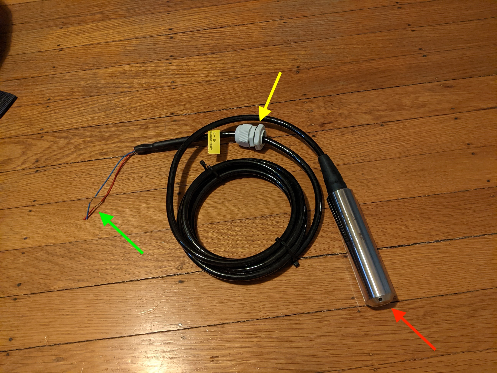
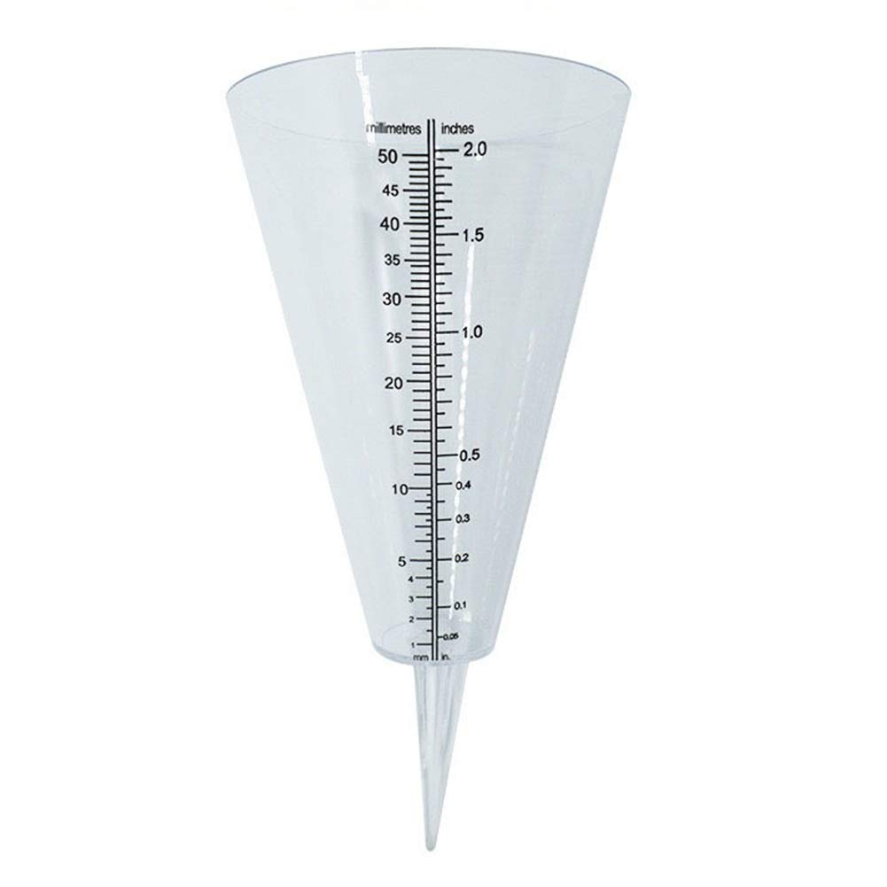
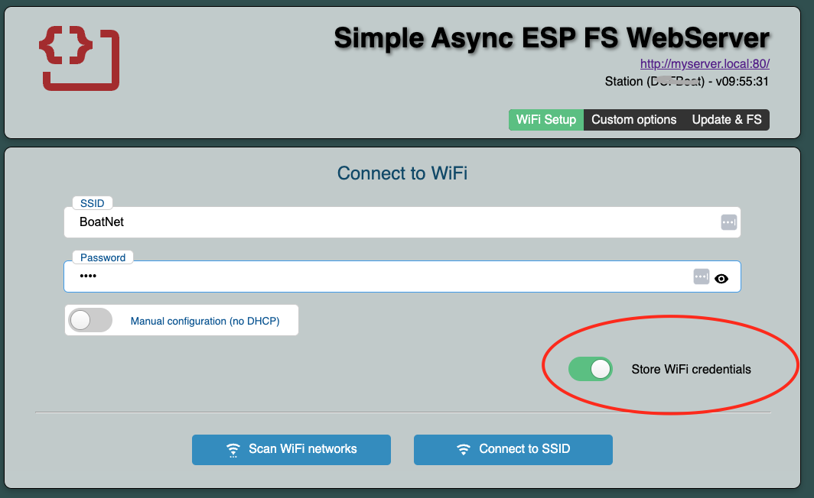
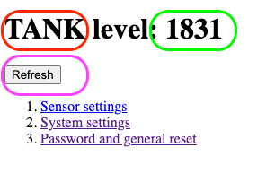
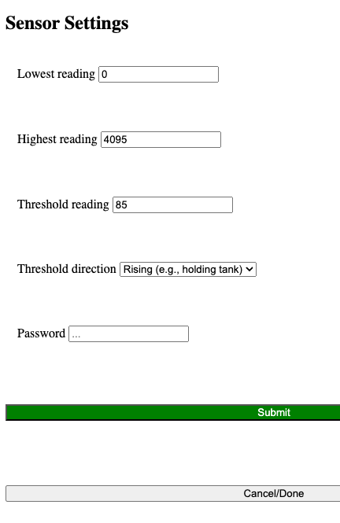

# TankSensor
ESP32=based sensor for tanks using 4-20mA sensor, and providing web access and graphics for readings

---
cmd-K V : show markdown preview

[This is a link](www.google.com)

This is an image


quotes:
> "Four score and seven..."
> *Lincoln*

Lists: start line with dashes (or stars)
- One
- Two
        * two point 5
- Three

Numeric list: (note that my numbers don't matter!)/Users/jfh/Desktop/TankSensorProject/TankSensor/TODO.txt

1. item
        1. indented item
        1. indented two
1. item
code snippets: start with triple-backtick and then proglanguage name: C, cpp, python, ...
```cpp
public main(String s)
```
Skipping the language name gives raw text

Separators: use "---" with a blank line before

---
# TODO


## Getting to know your tank monitor

You've got this tank monitor, and you want to use it to monitor the fullness of some tank -- perhaps a fuel tank, or a water tank, or a sewage holding tank on a boat. To make that happen, you'll need not just the physical device, but also a sensor that looks like this:  
You'll also need some tools, a few miscellaneous parts, and some ingenuity. It'll be very helpful if you have a smartphone or computer, and if your installation environment has a local WiFi network. 

This monitor unit itself has connectors for four wires (+12V, 0V, sensor -, sensor +), a display, a metal panel (the "touch sensor") and two buttons near one end of the display. It can display the tank fullness either on its display or via a WiFi connection. If there's a local WiFi Network, you can connect the tank sensor to it; if not, it'll create its own tiny WiFi network to which you can connect with your phone or other device to read the current tank level and adjust various settings. 

## Step 1: the sensor

First, you'll want to get a 4-20mA sensor (these are an industry standard) that's appropriate for the depth of your tank. You can find these for about $22 on AliExpress. They come in many varieties; the main goal is to get one that works with 4-20mA (rather than RS485 or 5V systems), and whose "depth range" matches your tank (typically a 1-meter or 2-meter depth-range is appropriate for tanks on cruising boats), and whose cable is long enough to reach from the tank to the monitor unit. These things are often sold with up to 5 meters of cable, but if you need more, you can use any 2-wire conductor to extend from the sensor back to the monitor, probably up to 100 feet. By the way, with an ESP32 reading the sensor value, you'll get 4096 gradations of depth, far more than you'll possibly need or than the display can show. If you use a sensor capable of 5-meter readings in a 1 meter tank, you'll still have 800 gradations of depth. So choosing the exact right depth-range isn't critical. 

The sensor head needs to go in your tank and be held in place somehow, especially if your tank is on a boat. The sensor is a heavy hunk of metal, and having it banging around in your tank is a bad idea. For my holding tank, for instance, I zip-tied the sensor to the bottom of the "dip tube" (the tube through which waste is sucked out through the top of the tank). For my fuel tank, I'll rig up a way to wedge it in place at the low point of the tank. 

The wire from the sensor then needs to come OUT of the tank. It may be that you can add a [bulkhead fitting](https://www.grainger.com/product/HUBBELL-WIRING-DEVICE-KELLEMS-Liquid-Tight-Cord-Connector-2DPE4) of a size suitable for the cable on your sensor; perhaps you can connect it in a fuel tank using whatever connection system was used for a float-based gauge in the past. I leave this part to your ingenuity. 

CAUTION: DO NOT use this to measure fullness of tanks containing gasoline or other flammable materials! 

Having installed the sensor, route the wiring to wherever you'll install the monitor and connect the positive wire to the "sensor +" terminal on the monitor, and the negative wire the the "sensor -" terminal. On my sensors, the positive wire is red and the negative wire is blue, but you should check your own device's instructions. 

Figure out a location for mounting the monitor and temporarily secure it. Measure for power leads to bring +12V and 0V to the monitor and trim as needed. Undo the monitor, secure the power leads, and re-secure the monitor permanently. 

# Where do I put it? 

Place the monitor somewhere where it won't get wet, and where you can reach it with your hands, and where you'll be able to see the display. During startup, you'll need to touch the monitor itself, so don't mount it in the back of a cabinet where you cannot reach it.  

## Digression: Power Mode
When power is first applied to the tank sensor, it enters one of two modes: *Regular mode* or *Power Mode*. In Power Mode, the two buttons on the front are active, and the WiFi software will let you edit various parameters to slightly change the behavior of the tank sensor. 

## Step 2: cold start

The first time you apply power to the monitor, you'll see the display show a bunch of words in sequence, things like "Display", "Buttons", "Persistence", and so on, and finally, in the center of the display, something like "PW: Alberg37". Then the display will clear and its backlight will shut off. This is its typical quiescent state, and uses almost no energy. To display the depth of fluid in the tank, you must touch the touch-sensor, at which point a Empty-to-Full gauge -- an arc with 1/4, 1/2, and 3/4 full markings, and a yellow pointer -- will appear and remain for 10 seconds after you last touch the touch-sensor. 

You could try this right now, but at this point, the display will be meaningless, because you have not calibrated it. Let's do that. 

## Step 3: Calibration without WiFi

Start the tank sensor in power mode by turning on the power to it, and holding your finger on the touch sensor for the first 5 seconds. On the display, you should see "Power mode on!" appear during the startup sequence, followed by some other things. 

Empty the tank that contains the sensor. The sensor reading, once the tank is empty, is the one we want to treat as the lowest possible. To record this reading in the monitor, press the left button on the monitor. When you do so, and touch the touch-sensor to make the gauge appear if it's turned itself off, you should see the yellow needle pointing to the "Empty" mark on the gauge. 

Now fill the tank, and press the right-hand button on the monitor. Again, turning on the display by touching the touch-sensor if necessary, you should see the needle pointing to the "Full" mark on the gauge. 

Important note: the monitor displays the pressure in the fluid at the bottom of the tank, which is proportional to the **depth** of the fluid in the tank. If your tank is box shaped, or a vertically-mounted cylinder, this pressure is proportional to the amount of fluid in the tank. If, however, your tank is tapered from a wide top to a narrow bottom, the depth of the fluid is *not* proportional to the amount of fluid. Look, for example, at this rain gauge: 

That rain-gauge can hold 50 milliliters of water, but when it has 20 ml in it, it's already well past halfway in depth. If your tank is tapered like this, your readings will be similar: a reading that shows as halfway down the bar graph may mean that your tank is only 1/3 full. 

## Finishing up calibration
Now that you have "empty" and "full" recorded, you should remove power to the tank sensor and turn it back on without touching the touch-sensor for the first 5 second. This will leave it in Regular Mode where the buttons are deactivated, so that no one can accidentally adjust the empty and full settings. 

## Step 3A (optional) Calibration with WiFi
When your tank monitor starts up, it'll try to connect to a Wifi network using a stored password, and the chances are very good that this is not the name and password for your network, so that connection will fail. When it does, the monitor will create its **own** Wifi network with a name like "ESP-23A46B21" (i.e., "ESP-" followed by 8 digits or letters). If you use your phone to connect to this network and open a browser like Chrome, you should see this:

## Using the local Wifi network
If you have a local WiFi network that you'd like the tank monitor connected to, you should enter, in the SSID field, the name of your wireless network (I've put in "BoatNet"), and in the Password field, the password for your Wifi network. Make sure that the "Store Wifi Credentials" slider-switch is on (as shown in the red oval), and click "Connect to SSID". 

Then click "OK" on any subsequent dialogs, and after a second or two, turn off power to the monitor and turn it back on. During this time, you should see the same sequence of startup messages, but the "Connected to Wifi" message should be followed with something like "Name: BoatNet", confirming that your monitor is now connected to your wireless network. 

From now it, it will remember the name and password for your Wifi, even when the power is shut off, so you won't have to do this again. 

Remember to disconnect your laptop or phone from the temporary "ESP-xxxxxxxx" network and reconnect to the actual WiFi network!

If at some point you change the Wifi network name or password, your monitor will no longer be able to connect, and will automatically start up the ESP-xxxxxxxx netowrk again, allowing you to enter the new credentials to use the local wireless. 

## Step 5: (optional) Using the WiFi connection. 
During startup, one of the messages on the screen will have been "visit: esp32-tank.local",
where the name "esp32-tank.local" might be something different, but probably not. Open a browser on your computer or phone, and in the address bar type "esp32-tank.local" (or whatever was displayed during startup). When you do so, you should see something like this:


The red oval shows the "tank name", which you can change from the default name, which is "TANK", as you'll soon see. The numbers to the right are the "raw" sensor reading,  a number between 0 and 4096. The margenta oval shows a "Refresh" button; clicking on this will update the sensor reading. On a boat, at least, where the tank is constantly moving around because of waves, etc., these sensor values vary over time. To make the display easier to read, we average the last 100 readings before displaying the result on the bar graph. 100 readings is perhaps 2 second's worth of readings, so there's a tiny bit of lag in the display in trade for a much smoother display of fullness. 

Each of the three links below the "Refresh" button lets you change some data that's stored in the monitor's memory between startups. Here's how the Sensor settings page looks:


You can see that for the tank shown, when the tank is empty the reading was 0, and when it was full, the reading was 4095. There's also a "threshold reading" Of 85, which says that at about the 5% level on the display, there's a red line indicating that anything below this level is critical. (Around 5 or 10% is a good choice for something like a fuel tank; around 85% or 90% is a good choice for a holding tank. The only thing this number controls is where to draw a red line on the display.)

The "threshold direction" option is completely ignored in the software for now. 

You can, through this interface, change any of these values. To do so, you'll need to enter the system password in the "Password:" field. It's the last thing displayed during startup before the bar graph appears. The initial password is `Alberg37`. I strongly recommend that you change it so that your neighbor in the marina can't connect to your monitor and mess with the settings. Once you'v entered new values and the password, you can press the large green "Submit" button to make the changes, and then the "Cancel/Done" button to return to the basic display where you started. You can also, after "submit", change the values further and re-submit as often as you like, only clicking "Cancel/Done" when you're happy with your settings. 

The "Systems Settings" dialog is similar. With it, you can change the name used to refer to this monitor. The default is `esp32-tank.local` (the `.local` is added by the software, so the "network name" field contains just `esp32-tank`). If you change the network name to `pinky`, then you'll need to point your browser to `pinky.local` to access the data in the future. 

You can also change the name of the sensor -- perhaps to "Fuel Tank" or "Holding Tank"; when you do, that'll replace the word `TANK` in the basic display. Once again, you'll need to enter the password to make such a change. 

Finally, the "Password and general reset dialog" lets you change the password from `Alberg37` to something you can remember easily, and also lets you do a general reset, so that the system returns to its initial 'cold start' state, forgetting all the settings you've entered until now. To avoid having you do this accidentally, you need to not only give the password, you need to type the word "reset" into the box indicated; if you don't do that, then no reset will happen (although a password change CAN happen). 

## That's it!
Aside from a few advanced features, that's the whole deal. The power used by this monitor is minuscule -- no more than about a half-Watt at its peak, including the backlight on the display. You're still welcome to power it down when it's not in use; startup takes about 10 seconds, 


# Overview
This project describes a system for measuring the fluid levels in a tank using a **4-20mA pressure sensor**, and communicating that level to a human. Other kinds of sensors could work as well, but they'd require some modifications to the code. We'll refer to this device and its software as a **monitor**. 

Here's an example of what the monitor display would show for a tank that's about 1/3 full, and whose critical fullness is indicated with a red line at about the 90% mark. 